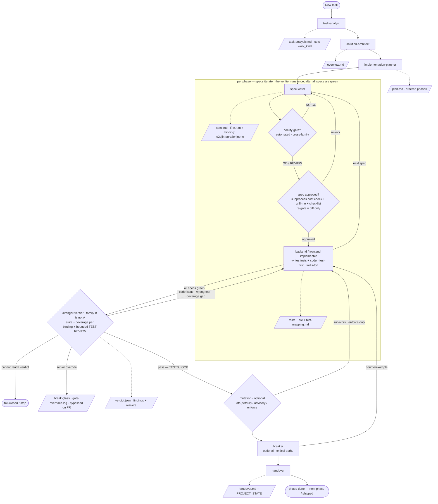

# agentic-avengers · plan-build-verify

A spec-driven, test-first agentic development pipeline that runs under **Claude Code** and
**opencode**. Specialised agents plan a feature; a **composed quality wall** (an automated fidelity
gate *and* a grill-me review) decides whether each spec is ready; the implementer then builds it
**test-first**, one vertical slice at a time; and every phase is verified once — by a fresh
cross-family model that reviews the tests as well as running them, plus cosmic-ray mutation — before
the suite locks and it ships.

The skill files (`SKILL.md`) and the gate brain (`gate_runner.py` + the rubric prompts) are a shared,
portable core; the opencode surface is a thin adapter generated from canonical sources.

---

## Enforcement model (the important part)

Gates fire **mid-session by default** in both runtimes, and the git floor (pre-commit + CI) backstops
them everywhere.

| Runtime | In-session gates | Backstop |
|---|---|---|
| Claude Code | native hooks (`hooks/hooks.json`) | git floor |
| opencode | native plugin (`.opencode/plugin/pipeline-gates.ts`) | git floor |

Both gate paths call the same `gate_runner.py` on a **cross-family** model (DeepSeek/Gemini via
OpenRouter), decorrelated from whatever model authored the work. Gates **fail closed** — a missing
key, an unreachable model, a non-JSON verdict, or a same-family model all **stop**. The only override
is **break-glass** (`GATE_BYPASS="reason"`): logged to `gate-overrides.log`, shown visibly, and
recorded in the phase `handover.md`. That reason is prose, so an agent under `/avenger-run --auto`
passes it from a file (`GATE_BYPASS="$(cat <file>)" git commit …`) like every other free-text
argument — a multi-line reason file is fine, since every writer of that log normalises it,
`scripts/bypass_log.sh` (the Verifier's per-finding waiver routes through it too), which normalises
the reason through `scripts/bypass_reason.sh` so it stays one parseable record. See
`skills/pipeline-conventions`.

---

## How it works

`Plan → Quality wall → (Build & verify loop ×phases) → Ship`.



```
PLAN
  task-analyst        -> docs/features/<feat>/task-analysis.md   (scope via grill-me; sets work_kind)
  solution-architect  -> docs/features/<feat>/overview.md
  implementation-planner -> docs/features/<feat>/plan.md         (phases; each = 1+ candidate specs <n>.<k>)

PER PHASE (specs iterate; the verifier runs once, after all specs are green)
  spec-writer         -> .../phases/<n>-<slug>/specs/<n>.<k>-<subslug>/spec.md
  QUALITY WALL (per spec, both gates)
    1. Automated Fidelity Gate (cross-family)   NO-GO -> back to spec-writer     [this repo only]
    2. Human spec review -> sets review_status: approved
         HITL:      /spec-review <spec>            (grill-me, one question at a time)
         Automated: /spec-review <spec> --auto     (SPEC_REVIEW_MODE=auto)
       + the only COST gate, mechanical, no model, both modes: scripts/subprocess_check.py
         (a test that spawns a process needs @pytest.mark.subprocess("<why>"))
       + an already-approved, already-implemented spec is re-gated on its DIFF only
    A spec reaches the implementer only when fidelity_verdict != NO-GO AND review_status: approved.
    Those two gates are also what pre-agrees the SEAMS the tests will be written at.

  backend/frontend implementer -> tests/<feat>/<n>-<slug>/<n>.<k>-<subslug>/ + src/
                 + that spec's test-mapping.md
                 skills/tdd, mode by work_kind:
                   greenfield -> red -> green, one vertical slice at a time
                   migration  -> parity-first; the EXISTING suite is the contract
                   refactor   -> baseline-first; behavior unchanged
  [repeat for each spec in the phase]

  avenger-verifier (once per phase, cross-family) -> verdict.json
                 full suite + coverage traced per requirement `binding:` (an e2e id is covered by
                 its journey; `none` is never a gap) + a BOUNDED test-quality review:
                 the tests mapped to the phase + test files it changed + their direct helpers.
                 Tautological / implementation-coupled / missing-negative = fail, even when green.
                 route-backs: code | wrong-gamed test | coverage gap -> implementer
  PASS -> THE PHASE SUITE LOCKS (locked-after-verify). Weakening a test then needs re-verification;
          adding one a later gate demands is always allowed.
  mutation (optional; MUTATION_POLICY off by default | advisory | enforce)
                 an extra signal, NOT the independence mechanism
  breaker (critical paths) -> counterexample -> implementer adds the test, fixes the code
  handover -> .../phases/<n>-<slug>/handover.md   (mirrors the verdict + any waived findings)

FEATURE CLOSE (once, after the final phase is green)
  implementer (e2e-author mode) -> tests/e2e/<feature>/ + e2e-mapping.md
                 1-3 tests (5 max) proving overview.md's goal through the assembled system
  commit 1: the e2e stage output, so the ship gate starts from a clean committed tree
  SHIP GATE: no-mistakes (/avenger-run 4a) -> lint, docs, push, PR, CI
                 the one sanctioned same-family gate; runs in BOTH modes; stops at
                 checks-passed and never merges. Its findings are logged as observations.
  RETROSPECTIVE TRIAGE (/avenger-run 4b, interactive only) -> lavish triage of those
                 observations; only what the human selects is filed as an issue.
  commit 2: the observation log, after triage (branch_sync decides how, never whether)

SHIP
  The ship gate opened the PR. The user reviews and merges — the orchestrator never does.
  Break-glass overrides logged + visible.
```

### Who writes the tests
The **implementer** does, test-first, using `skills/tdd` (vendored from
[mattpocock/skills](https://github.com/mattpocock/skills), MIT — see `skills/tdd/ATTRIBUTION.md`):
one seam, one failing test, the minimal code to pass it, repeat. Never the whole suite up front.

That means the author of the code also authors its judge, so two controls buy the independence back:
1. **The Verifier reviews the tests**, not just the run — on a *green* suite as well as a red one.
   It is the only outside judgement that suite gets, and passing it is what locks it.
2. **The suite locks at the Verifier.** Before it, the implementer owns `tests/`; after it, nobody
   edits them — later gates may demand *added* tests, never weakened ones.

### The three test modes (set by `work_kind`, all inside `skills/tdd`)
- **greenfield** — red → green per vertical slice, at the requirement's seam.
- **migration** — parity-first. The **existing suite is the contract**: record its baseline, run it
  against the migrated code, and add characterization tests only at genuine gaps on critical seams.
- **refactor** — baseline-first, behavior unchanged. The migration procedure without a port; an
  intentional behavior change is greenfield work with its own requirement.

### Relationship to `klm-agentic-pipeline`
This pipeline is the sibling of `klm-agentic-pipeline` and deliberately shares its semantics. Known
intended differences: this one runs on **Claude Code + opencode** rather than GitHub Copilot; it adds
the automated **Fidelity Gate**; it keeps a **feature-level e2e** stage and **spec-isolation-review**;
and its mutation gate has a **deterministic, diff-scoped scorer** (`scripts/mutation_score.py` +
`cr-filter-git`).

Two further mechanisms live here whose status against the sibling is **unconfirmed**: the mechanical
**subprocess cost gate** (`scripts/subprocess_check.py`, run from the spec-review hook in both modes)
and **diff-scoped re-gating** of a spec already approved and implemented. Whether
`klm-agentic-pipeline` has either was not checkable from this repository, so this list is not a
completeness claim in either direction — a divergence absent from it is not thereby drift.

---

## Component locations

| Component | Claude Code | opencode |
|---|---|---|
| Skills (`SKILL.md`) | `skills/` (plugin) | `.opencode/skills/` (symlink → `../skills`) |
| Agents | `agents/*.md` | `.opencode/agents/*.md` (generated) |
| Conventions | `pipeline-conventions` skill + `CLAUDE.md` | `AGENTS.md` |
| Commands | `commands/*.md` | (n/a — drive with `@agent`) |
| Gates (in-session) | `hooks/hooks.json` | `.opencode/plugin/pipeline-gates.ts` |
| Gates (floor, all) | git pre-commit + CI → `gate_runner.py` | same |
| Distribution | `/plugin install` / `/plugin update` | `scripts/install.sh` (versioned, update-aware) |

> `agents/`, `skills/`, `prompts/`, `scripts/`, `commands/`, `hooks/` are the **canonical sources**.
> The opencode copies under `.opencode/` are **generated** — do not hand-edit them.

---

## Canonical layout

```
agentic-avengers/
├── .claude-plugin/        plugin.json, marketplace.json
├── agents/                canonical subagents (Claude format)
├── skills/                portable SKILL.md skills (pipeline-conventions, grill-me,
│                          spec-review-checklist, tdd, verifier-triage,
│                          mutation-interpret, codemap, self-improvement,
│                          pipeline-retrospective, e2e-author, …)
├── commands/              pipeline-init.md, spec-review.md
├── hooks/                 hooks.json  (Claude Code in-session gates)
├── prompts/               fidelity-rubric.md, spec-review-rubric.md, project-setup.md
├── docs/templates/        spec / plan / overview / task-analysis / handover / verdict templates
├── docs/rubrics/          overview + plan rubrics
├── docs/lessons/          committed, team-shared lessons log (see the self-improvement skill)
├── cosmic-ray.toml        mutation base config (the gate diff-scopes a copy per phase)
├── scripts/
│   ├── gate_runner.py         cross-family verdict caller (opencode | openrouter), family-asserted
│   ├── gate_runner_guard.sh   refuses a runner that cannot identify itself as the shipped one
│   ├── gate_errors.py         the failure taxonomy: every gate failure names its own cause
│   ├── gate_timeouts.py       asserts each hook's budget outlives the provider call inside it
│   ├── model_vendors.py       the one vendor table; an unknown vendor is a loud refusal
│   ├── proc_group.py          a child a timeout actually stops (own process group, no orphans)
│   ├── gate_ci.sh             git/CI floor entry point (fidelity + tests + cosmic-ray + break-glass)
│   ├── subprocess_check.py    the cost gate: unjustified subprocess spawners in tests (no model)
│   ├── spec_gate_cache.py     body + verdict each gate last reached, so a re-gate stays in the diff
│   ├── verifier_bundle_scope.py  sends the Verifier only the specs that changed; carries the rest
│   ├── mutation_score.py      deterministic mutation verdict (baseline-guarded; no model call)
│   ├── mutation_target.py     is there anything to mutate? (the gate's only legal skip)
│   ├── bypass_log.sh          break-glass logger for hooks
│   ├── hook_*.sh              Claude Code hook wrappers
│   ├── codemap.py             tree-sitter codebase map -> codebase/MOC.md
│   ├── sync_opencode.py       canonical agents -> .opencode/agents + skills symlink
│   ├── sync_runtimes.sh       run the opencode transpiler
│   ├── install.sh             versioned vendor into a target repo (NEW/UPDATE/DRIFT/GONE)
│   └── vendor_runtime.sh      legacy copy (superseded by install.sh)
├── tavern/                pixel-art fleet monitor (tavern/README.md; docs/FIRSTMATE.md for fleet layering)
├── .opencode/
│   ├── agents/            generated
│   ├── skills/            symlink -> ../skills
│   └── plugin/pipeline-gates.ts   in-session gates for opencode
├── .github/workflows/pipeline-gates.yml   CI floor
├── .no-mistakes.yaml      feature-close ship gate config (see skills/pipeline-conventions)
├── AGENTS.md              opencode conventions
├── .pre-commit-config.yaml
├── CLAUDE.md
└── README.md
```

---

## Requirements

- **Claude Code** (Skills, hooks) and/or **opencode**.
- **Python 3**, **`pytest`**, **`cosmic-ray`** (mutation), **`jq`**, and **`tree-sitter`**
  (+ `tree-sitter-python`/`-java`/`-c` for codemap) in the target repo.
- A cross-family provider: **`OPENROUTER_API_KEY`** exported (gates use OpenRouter), and/or opencode
  configured. Set **`AUTHOR_FAMILY`** (default `anthropic`) so the cross-family assertion knows the
  build family.
- **`no-mistakes`**, in **three** separate states — the feature-close ship gate (`/avenger-run` §4a)
  needs all of them, in interactive *and* `--auto` runs, and preflight checks each one:
  1. **on PATH with a runnable pipeline agent** — `no-mistakes doctor`.
  2. **the repo initialised** — `no-mistakes init` creates the bare gate repo, the post-receive hook,
     the `no-mistakes` remote and the DB record. A `.no-mistakes.yaml` existing implies **none** of
     that. `no-mistakes axi` exits 1 with `error: repo not initialized` when it is missing.
  3. **a filled-in `.no-mistakes.yaml`** at the repo root. `/pipeline-init` scaffolds it with
     `REPLACE_ME` placeholders; **fill in `commands.lint` and `commands.test` before the first run**,
     because preflight checks the content, not just the file's existence.
- **`lavish-axi`** on PATH — the plan-approval stop (§3) and the retrospective triage (§4b).
  Interactive runs only; `--auto` skips both surfaces.

Neither of those two has a fallback, on purpose: **preflight stops the run** when one is missing or
unfilled, rather than silently degrading a gate.

---

## Setup per runtime

**Claude Code**
```text
/plugin marketplace add szobonyaerik/agentic-avengers
/plugin install plan-build-verify@erik-tools
chmod +x scripts/*.sh
/pipeline-init                       # scaffold docs/features, gitignore, conventions, codemap, prereqs
```
Hooks in `hooks/hooks.json` fire the gates mid-session. Update later with `/plugin update`.

**opencode**
```text
python3 scripts/sync_opencode.py     # generate .opencode/agents + link .opencode/skills
export OPENROUTER_API_KEY=...          # the plugin's gates call OpenRouter
```
Drive agents with `@avenger-task-analyst "…"`, etc. (see `AGENTS.md`).

**Into another repo** — with update detection:
```text
scripts/install.sh /path/to/project           # vendor opencode + git floor + scripts (writes .avengers/manifest)
scripts/install.sh /path/to/project --check    # report what a re-install WOULD change
scripts/install.sh /path/to/project --prune    # apply + remove upstream-deleted (unmodified) files
cd /path/to/project && pre-commit install
```
Re-running classifies each file NEW / UPDATE / SAME / **DRIFT** (your local edits — skipped) / **GONE**.

---

## Keeping runtimes in sync

Canonical sources are `agents/`, `skills/`, `commands/`. After editing any of them:
```text
scripts/sync_runtimes.sh             # regenerates the .opencode/ adapter
```
`AGENTS.md` carries the opencode conventions and is hand-maintained from
`skills/pipeline-conventions/SKILL.md` — update it only when the rules themselves change.

---

## codemap

Generate the map the Solution Architect and implementers read:
```text
python scripts/codemap.py . --lang python --output codebase     # -> codebase/MOC.md
```
The structural map (tree-sitter: exports, dependencies, used-by) is the whole product right now.
The optional LLM-backed one-line **purpose** backfill is **temporarily disabled**. An existing
`.codemap-manifest.json` is still read, so a purpose an earlier model-backed run cached keeps
rendering for as long as that file's hash matches; `(undocumented …)` is what a file with no
docstring/KDoc/Javadoc *and* no matching cache entry renders. No new purpose is resolved and the
manifest is never rewritten while disabled. Passing `--provider` / `--model` / `--base-url` /
`--api-key` exits with an explanation rather than silently producing an undocumented map.

---

## Notes
- Gates **fail closed** — missing key, unreachable model, non-JSON verdict, or same-family model stops.
- The mutation gate feeds cosmic-ray's `dump` (survivors) to the model rather than parsing it, so it
  survives tool version changes (one model call per phase). Score = 1 − survival rate.
- Break-glass is the only override, and it is never silent (logged + shown + recorded in handover).
- Skills are symlinked into `.opencode/` (`SKILL.md` is identical). On Windows, copy instead.
- `hook_verifier.sh`, `gate_ci.sh`, the opencode plugin, and `cosmic-ray.toml` assume code under
  `src/`; change that to your layout if it isn't.
- License: MIT.
